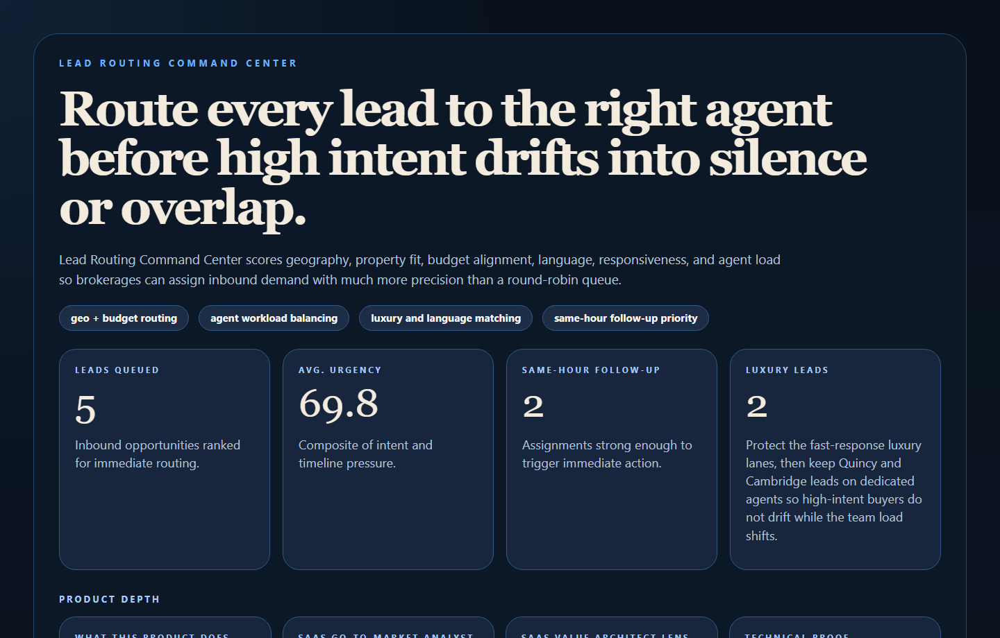
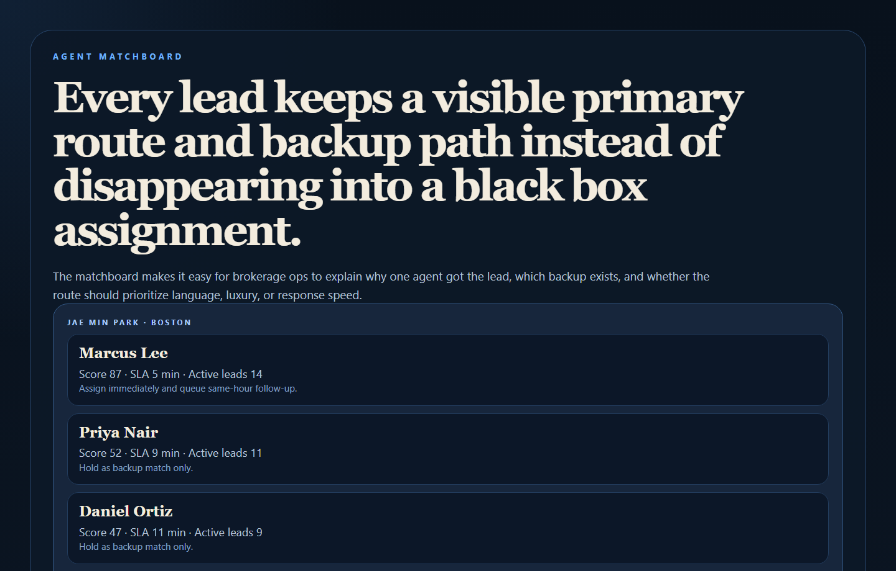
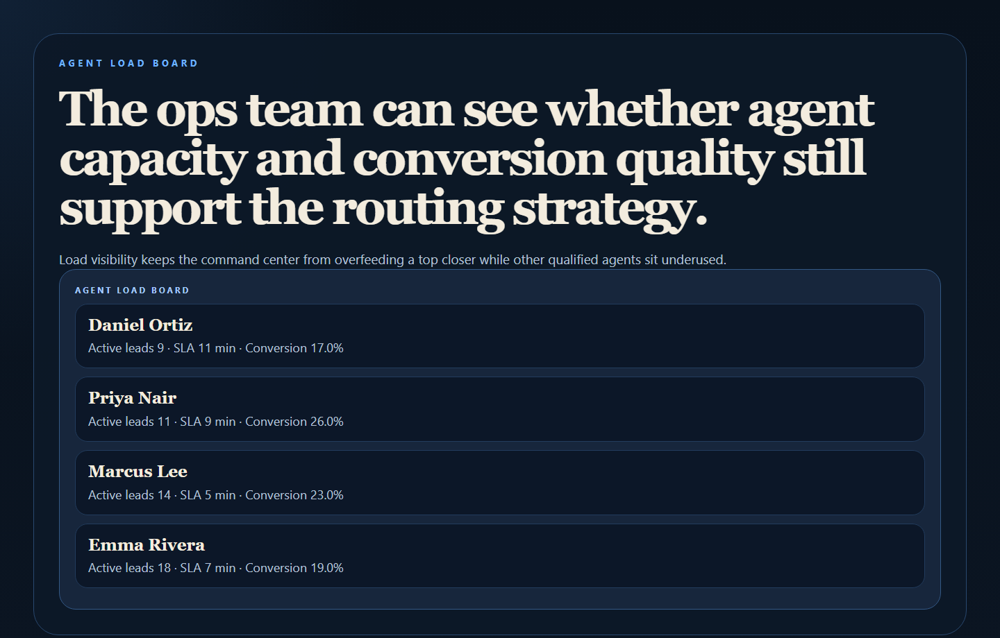
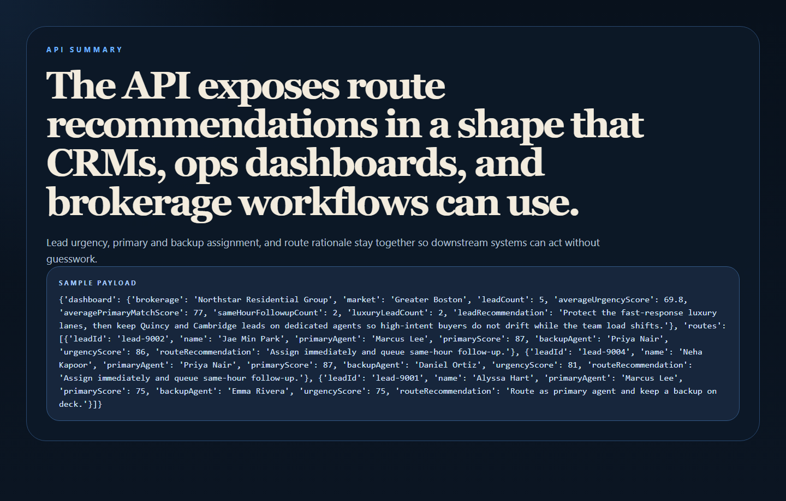

# Lead Routing Command Center

Lead Routing Command Center is a brokerage routing engine for matching inbound real estate leads to the right agent based on geography, property type, budget, responsiveness, workload, language fit, and luxury readiness.

- Live: `https://mizcausevic-dev.github.io/lead-routing-command-center/`
- Repo: `https://github.com/mizcausevic-dev/lead-routing-command-center`



## Why this repo is good

- It targets a real brokerage pain point: getting high-intent leads to the right person fast.
- It turns matching into explainable routing instead of opaque round-robin assignment.
- It connects naturally to sales ops, follow-up workflow, and performance accountability.

## What it does

- Scores lead-to-agent fit across zone, property type, budget, language, luxury expectations, response SLA, and load.
- Recommends both a primary route and a backup agent.
- Highlights same-hour follow-up lanes for high-intent demand.
- Exposes a clean API plus operator-friendly proof surfaces.

## Proof





## Local run

```powershell
cd lead-routing-command-center
py -3.11 -m venv .venv
.\.venv\Scripts\python.exe -m pip install -r requirements.txt
.\.venv\Scripts\python.exe -m app.main
```

Open:

- `http://127.0.0.1:4762/`
- `http://127.0.0.1:4762/matchboard`
- `http://127.0.0.1:4762/agent-loads`
- `http://127.0.0.1:4762/api-summary`
- `http://127.0.0.1:4762/docs`

## Validation

```powershell
.\.venv\Scripts\python.exe -m unittest discover -s tests
.\.venv\Scripts\python.exe scripts\run_demo.py
.\.venv\Scripts\python.exe scripts\smoke_check.py
.\.venv\Scripts\python.exe scripts\prerender_site.py
.\.venv\Scripts\python.exe scripts\render_readme_assets.py
```

## API shape

Endpoints:

- `/api/dashboard/summary`
- `/api/leads`
- `/api/agents`
- `/api/leads/{lead_id}`
- `/api/sample`

## Repo layout

```text
app/
  data/
  services/
docs/
scripts/
screenshots/
tests/
```
